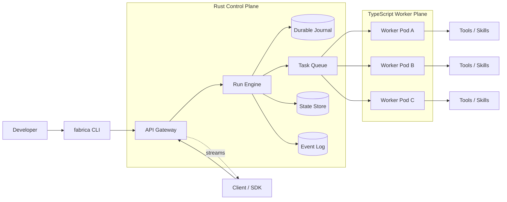

# Fabrica Architecture

Fabrica is a distributed AI agent framework with:

- **Vercel Eve-like DX**: file-first agents, TypeScript tools, Markdown prompts.
- **Hatchet-like execution**: durable tasks, distributed workers, retries, checkpointing.
- **Rust core engine**: actor scheduling, work stealing, state durability, high throughput.
- **RPC boundary**: Rust ↔ TypeScript via ConnectRPC/gRPC, not FFI.

---

## 1. Core Goals

1. **Simple authoring**
   - Agents defined by folders/files.
   - Tools inferred automatically from TypeScript file names.
   - Prompts written in Markdown.

2. **Typed agent boundaries**
   - Every agent has explicit input/output types.
   - Agents behave like typed actors/functions.

3. **Durable execution**
   - Runs survive crashes.
   - Tasks can be retried or resumed.
   - Long-running workflows can park and resume.

4. **Distributed work stealing**
   - Agents/tasks are not pinned to one pod.
   - Any available worker/pod can pick up work.
   - Many actors can run inside one pod.

5. **Performance**
   - Rust handles orchestration, scheduling, and state durability.
   - TypeScript handles developer-facing tools and business logic.
   - Local communication uses Unix Domain Sockets where possible.

Where the LLM loop itself executes (Rust engine vs TypeScript worker) is an
explicit open decision. See section 28, Decision D1.

---

## 2. High-Level Mental Model

Fabrica separates:

- **Control Plane / Engine**
  - Rust-based.
  - Manages runs, journals, queues, leases, retries, timers.

- **Worker Plane**
  - TypeScript workers.
  - Execute tools, agent loops, skills, and workflow functions.
  - Connect to Rust engine through ConnectRPC/gRPC.

- **Developer Surface**
  - File-based project structure.
  - TypeScript-first DX.
  - Markdown prompts.

- **Client Surface**
  - ConnectRPC HTTP API.
  - Generated TS SDK.
  - Streaming responses, cancellation, run status.

---

## 3. Repository Layout

```txt
fabrica/
├── agents/
│   ├── support-triage/
│   │   ├── agent.ts
│   │   ├── instructions.md
│   │   └── examples.md
│   └── code-reviewer/
│       ├── agent.ts
│       └── instructions.md
│
├── tools/
│   ├── get_weather.ts
│   ├── search_web.ts
│   └── create_ticket.ts
│
├── skills/
│   ├── summarize.md
│   ├── refund-policy.md
│   └── tone-friendly.md
│
├── workflows/
│   ├── ticket-triage.ts
│   └── release-notes.ts
│
├── fabrica.config.ts
└── .fabrica/
    └── generated/
        ├── tools.d.ts
        ├── agents.d.ts
        └── schemas.json
```

### Naming

Use:

```txt
workflows/
```

instead of:

```txt
orch/loop
```

`workflows/` is clearer and aligns with Hatchet/Temporal-style durable orchestration.

`fabrica.config.ts` also configures MCP servers (imported as tools) and
triggers. See sections 4.2 and 19.

---

## 4. Core Primitives

### 4.1 Agent

An agent is a typed actor.

It defines:

- Input schema
- Output schema
- System prompt
- Optional user prompt transformer
- Allowed tools
- Optional skills
- Optional model config
- Optional permission grants
- Optional run limits

Example:

```ts
// agents/support-triage/agent.ts
import { defineAgent } from "fabrica/agent";
import { z } from "zod";

export default defineAgent({
  input: z.object({
    ticketId: z.string(),
    message: z.string(),
  }),

  output: z.object({
    category: z.enum(["billing", "bug", "feature", "other"]),
    severity: z.enum(["low", "medium", "high"]),
    suggestedReply: z.string(),
  }),

  tools: ["search_docs", "create_ticket"],

  skills: ["tone-friendly"],

  model: {
    provider: "openai",
    name: "gpt-4o",
  },

  permissions: ["read:docs", "write:tickets"],

  limits: {
    maxSteps: 25,
    maxTokens: 200_000,
  },

  userPrompt: ({ input }) => {
    return `Triage this ticket:\n\n${input.message}`;
  },
});
```

The system prompt comes from:

```txt
agents/support-triage/instructions.md
```

`limits` are enforced by the engine, not the LLM:

- `maxSteps` bounds the reasoning/tool loop.
- `maxTokens` bounds spend per run.

Exceeding a limit fails the run deterministically. This is a run failure,
not an LLM-visible error. Unbounded agent loops are a cost and liveness
hazard; caps are mandatory defaults, not opt-ins.

---

### 4.2 Tool

A tool is a typed, stateless TypeScript function.

Tool name is inferred from file name.

```txt
tools/get_weather.ts
```

becomes:

```ts
"get_weather";
```

Example:

```ts
// tools/get_weather.ts
import { defineTool, ToolError } from "fabrica/tool";
import { z } from "zod";

export default defineTool({
  input: z.object({
    city: z.string(),
  }),

  output: z.object({
    temperature: z.number(),
    summary: z.string(),
  }),

  // Optional: scopes this tool requires.
  // Engine refuses the call if the calling agent lacks the grant.
  requires: ["read:docs"],

  async execute({ input }) {
    return {
      temperature: 22,
      summary: `Weather in ${input.city} is clear.`,
    };
  },
});
```

Tools must be:

- Pure where possible.
- Stateless.
- Retry-safe.
- Idempotent where external effects occur.

#### Error taxonomy

Tool failures are not all the same thing. Three classes:

1. **LLM-visible error** (default for thrown `ToolError`):
   - Returned to the agent as an error tool-result.
   - Failure is information for the model; the run continues.
2. **Retryable error** (`new ToolError(msg, { retry: true })`):
   - Engine retries with backoff before the LLM sees it.
3. **Fatal error** (`throw new FatalRunError(...)`):
   - Fails the run, parks it for inspection.

Classifying a failure wrong is a correctness bug: a flaky HTTP call fed
straight to the LLM wastes steps; a programming error retried forever
wastes money.

#### MCP tools

External MCP servers configured in `fabrica.config.ts` are imported as
tools under their server-prefixed names:

```txt
"github.create_issue"
```

File tools win on name conflict.

---

### 4.3 Skill

A skill is a reusable capability package.

It can contain:

- Prompt fragments
- Model settings
- Few-shot examples
- Optional tool preferences

Example:

```md
<!-- skills/tone-friendly.md -->

Respond with a friendly, concise, professional tone.
Avoid jargon.
If unsure, ask a clarifying question.
```

Skills are attached to agents:

```ts
skills: ["tone-friendly", "summarize"];
```

Precedence rules:

- Prompt fragments: all skills compose, injected in listed order.
- Model settings: agent config wins over skills; among skills, later in the list wins.
- Tool preferences: union of agent tools and skill preferences, intersected with agent permissions.

---

### 4.4 Workflow

A workflow defines orchestration.

Workflows can:

- Call agents
- Call tools directly
- Branch
- Loop
- Fan out/fan in
- Wait for human approval
- Wait for external events

Example:

```ts
// workflows/ticket-triage.ts
import { defineWorkflow } from "fabrica/workflow";
import { z } from "zod";

export default defineWorkflow({
  input: z.object({
    ticketId: z.string(),
  }),

  output: z.object({
    resolved: z.boolean(),
  }),

  async run({ input, agent, tool, wait }) {
    const triage = await agent("support-triage", {
      ticketId: input.ticketId,
      message: "Customer says billing is broken.",
    });

    if (triage.severity === "high") {
      await tool("create_ticket", {
        title: "High severity billing issue",
        category: triage.category,
      });

      await wait.forHumanApproval({
        reason: "High severity action requires approval",
      });
    }

    return { resolved: true };
  },
});
```

Note: `if (triage.severity === "high")` is a branch on runtime LLM output.
Workflows support arbitrary TypeScript control flow. Execution semantics
are journal-based. See section 15.

---

## 5. Runtime Architecture



---

## 6. Rust Core Engine

The Rust engine is responsible for:

- Run registry and lifecycle
- Durable journal
- Task queue and leasing
- Actor lifecycle
- Checkpointing
- Retries, timeouts, timers
- Event logging
- Security enforcement
- Observability

### Runtime choice

Tokio at the edges, runtime-agnostic core:

- The actor kernel and queue/state-machine logic depend only on
  `futures` + `async-channel`/`async-lock`/`async-broadcast`.
  These crates are runtime-agnostic; they run fine under tokio.
- Tokio is wired only in the outer crate: tonic/axum (network),
  sqlx (Postgres), timers, telemetry.
- tonic and axum/hyper effectively require tokio. Fighting that is a
  permanent ecosystem tax. Conversely, smol's best primitives cost
  nothing to use under tokio.
- Keeping the core agnostic keeps it deterministic and cheap to test,
  fast to compile in the dev loop, and portable if the runtime is ever
  revisited (including thread-per-core io_uring options, which are the
  only genuinely interesting off-tokio alternative at high throughput).

Crate layout:

```txt
crates/
├── fabrica-core    # actor kernel, queue semantics, state machines
│                   # no I/O, no tokio
├── fabrica-engine  # tokio wiring: tonic, sqlx, redis, otel
└── fabrica-cli     # thin binary
```

### Other dependencies

- `axum` or `tonic` for APIs
- `sqlx` for Postgres
- `redis` for hot cache/locks
- Postgres `LISTEN/NOTIFY` for v1 signals; NATS or Redis Streams deferred
- ConnectRPC/gRPC for worker communication

---

## 7. Actor Model

Every agent invocation is represented as a virtual actor.

"Actor" is a naming convention over a keyed, journaled state machine:

- The task queue is the source of truth for what runs next.
- An actor is run state keyed by actor ID, persisted in the journal.
- The engine activates an actor by leasing a task that targets it.

Actor properties:

- Actor ID
- Agent ID
- Run ID
- Mailbox
- State checkpoint
- Parent actor
- Child actors
- Status

Actor behavior:

- Receives messages.
- Processes one message at a time.
- Persists state after meaningful steps.
- Parks when idle.
- Resumes when new input arrives.

Activation semantics:

- First message to an actor ID activates it: engine loads state from
  the journal and dispatches.
- Single activation is guaranteed by a per-actor lease. One mechanism
  (Postgres row lock), not two (no dual Redis + Postgres locking).
- Parked actors wake via queue tasks or event subscriptions.

Garbage collection:

- Completed run actors: state TTL, default 24h, configurable.
- Session-bound actors (section 18): pinned to session TTL.

Sub-agents are child actors.

Parent actors should not block waiting for children.

Instead:

1. Parent spawns child actor.
2. Parent parks/checkpoints.
3. Child completes.
4. Event resumes parent.

This avoids thread pool exhaustion and deadlocks.

---

## 8. Task Queues and Delivery Semantics

Fabrica uses a Hatchet-like distributed worker model.

("Work stealing" here means lease takeover across workers/pods — not
in-process scheduler stealing.)

### Delivery semantics

- Delivery is **at-least-once**. Exactly-once is a lie at this layer.
- Duplicate execution is possible; consumers must be idempotent.
- Tool call ID is the idempotency key for external effects.
- For external systems that support fencing, tasks carry a monotonically
  increasing fencing token tied to the current lease epoch.

### Lease protocol

1. Worker acquires task lease.
2. Worker heartbeats every N seconds; lease renews.
3. If heartbeats stop beyond the grace period, the lease expires and the
   task is re-dispatched.
4. A slow-but-alive worker whose heartbeats are current never loses its
   lease. Renewal is what prevents systematic double execution of long
   tasks; expiry alone is not enough.

### Queue implementation

- v1: Postgres. `FOR UPDATE SKIP LOCKED` + visibility timeout.
  One store, transactional with the journal. Simple, correct, fast
  enough for thousands of tasks/sec.
- Later: Redis Streams consumer groups for very hot queues, behind the
  same lease interface.

### Local dev (SQLite)

SQLite has no row locks and no `SKIP LOCKED`.

`fabrica dev` uses an in-process queue instead. The queue is a trait in
`fabrica-core`; Postgres and in-process are two implementations of it.

### Failure handling

If a worker dies mid-task:

- Lease expires.
- Task becomes available.
- Another worker picks it up.
- Execution resumes from checkpoint.

### Dead letters

After max retries, a task moves to a dead-letter queue linked to its run.

DLQ is inspectable and replayable from CLI/UI. Poison tasks fail loudly
there, never silently vanish.

A pod can host:

- Many workers.
- Many concurrent tasks.
- Many actor executions.

Tasks are not tied to pods.

Pods are disposable execution capacity.

---

## 9. Rust ↔ TypeScript Boundary

Fabrica does not use FFI for user code.

Instead:

```txt
Rust Engine <-> ConnectRPC/gRPC <-> TypeScript Worker
```

### Transport direction

The worker holds one long-lived bidirectional stream to the engine.

The engine pushes tasks over that stream.

Reason:

- Workers are clients; the engine never dials workers.
- Works behind NAT, in Kubernetes, across regions.
- One connection per worker, multiplexed.

### Local Development

Use:

```txt
Unix Domain Socket
```

Reason:

- Lower latency.
- No TCP overhead.
- Simpler local security.

Caveat: Node's `fetch()` needs explicit UDS support (undici custom
dispatcher / `socketPath`; Bun supports it natively). If a runtime
lacks it, fall back to localhost TCP locally. Not a blocker; verify
early in Phase 3.

### Production

Use:

```txt
gRPC / HTTP2 / ConnectRPC over mTLS
```

Workers can run:

- In the same pod.
- In separate pods.
- In different regions.
- In Docker containers.
- In Kubernetes deployments.

---

## 10. TypeScript Worker

The TypeScript worker is a long-running process.

It:

- Connects to Rust engine (one bidi stream).
- Registers available tools and schemas.
- Registers available workflow handlers.
- Receives tasks over the stream.
- Executes tools, agent loops, and workflow functions.
- Returns typed results.
- Reports errors.
- Heartbeats leases.
- Sends logs/traces.

The worker should maintain a pool of isolates or worker threads.

Possible runtimes:

- Node.js
- Deno
- Bun

### Isolation limits — honest version

Worker threads provide **timeouts and concurrency caps only**.
Node does not enforce CPU or memory caps per worker thread.

Options for real limits:

- `isolated-vm` (V8 isolates with memory limits)
- Subprocess per task + cgroups
- WASM sandbox (later)

v1: worker-thread pool + timeouts + per-worker concurrency caps.
Real resource sandboxing is a later phase. Do not claim limits the
runtime cannot enforce.

---

## 11. Hot State vs Durable State

This is critical.

### Hot State

Kept in Rust memory or Redis.

Includes:

- Active LLM conversation context.
- Current reasoning loop.
- Temporary scratchpad.
- Fast actor mailbox state.
- Live token streams.

Hot state is optimized for latency.

### Durable State

Stored in Postgres/journal.

Includes:

- Workflow run status.
- Step checkpoints (journal entries).
- Tool call results.
- Approval states.
- Agent outputs.
- Retry metadata.
- Completed assistant messages.

Durable state is optimized for recovery.

### Rule

Do not checkpoint every tiny LLM thought to Postgres.

Checkpoint at meaningful boundaries:

- Workflow step completed.
- Tool call completed.
- Agent produced output.
- Assistant message completed.
- Human approval requested.
- External side effect occurred.

A crashed run must not lose a completed 40k-token assistant message,
but it must not write to Postgres per token either. Completed messages
are durable; the token stream is ephemeral.

---

## 12. Execution Flow

The LLM loop placement is Decision D1 (section 28). Both variants:

### Variant A: LLM loop in Rust engine

```txt
1. Request arrives.
2. Rust engine creates run.
3. Engine creates actor.
4. Engine loads agent definition.
5. Engine runs LLM loop.
6. LLM requests tool call.
7. Engine enqueues tool task.
8. TypeScript worker leases task.
9. Worker executes tool.
10. Worker returns result.
11. Engine journals result.
12. Engine feeds result back to LLM.
13. Agent produces output.
14. Engine completes run.
```

### Variant B: LLM loop in TypeScript worker

```txt
1. Request arrives.
2. Engine creates run, journals input.
3. Engine enqueues agent-loop task.
4. Worker leases task, loads agent definition.
5. Worker runs LLM loop, streaming tokens to client.
6. LLM requests tool call.
7. Worker reports step; engine journals and enqueues tool task.
8. Tool worker leases and executes.
9. Engine journals result, notifies agent-loop worker.
10. Agent loop resumes with result.
11. Agent produces output; engine journals, completes run.
```

In both variants, a crash at any leased step:

```txt
Heartbeats stop.
Lease expires.
Another worker picks up the task.
Task retries or resumes from journal.
```

---

## 13. Auto-Inference, Schemas, and DX

Fabrica should provide strong autocomplete.

When developer writes:

```ts
tools: [""];
```

The IDE should suggest:

```ts
"get_weather";
"search_web";
"create_ticket";
```

Implementation:

1. CLI scans `tools/`.
2. CLI parses tool names and schemas.
3. CLI generates `.fabrica/generated/tools.d.ts`.
4. Agent definitions use generated literal types.

Example generated type:

```ts
export type ToolName = "get_weather" | "search_web" | "create_ticket";
```

Agent definition:

```ts
tools: ToolName[]
```

This gives compile-time validation and autocomplete.

### The schema bridge

Zod schemas live in TypeScript. The engine needs schemas at
registration and scheduling time (input validation on enqueue, tool
definitions for the LLM).

Bridge:

1. At registration, the worker/CLI converts each zod schema to JSON
   Schema (`zod-to-json-schema`) and emits `.fabrica/generated/schemas.json`.
2. The engine validates inputs with JSON Schema at enqueue time.
3. Workers validate with zod at execution time.
4. Each definition carries a schema hash. If a worker's hash differs
   from the engine-registered hash for the same version, registration
   fails. No silent drift.

---

## 14. Agent Definition Contract

Each agent folder should contain:

```txt
agents/my-agent/
├── agent.ts
├── instructions.md
├── examples.md
└── schema.generated.ts
```

Minimum required:

```txt
agent.ts
instructions.md
```

`agent.ts` defines:

- Input schema
- Output schema
- Tools
- Skills
- Model config
- Permissions
- Limits
- Prompt assembly

`instructions.md` defines:

- System prompt
- Behavioral rules
- Constraints

`examples.md` optional:

- Few-shot examples
- Evaluation cases

---

## 15. Workflow Execution Model

Workflows support:

- Sequential steps
- Parallel branches
- Retries
- Timeouts
- Human approval
- Event waiting
- Agent delegation
- Error recovery
- Arbitrary TypeScript control flow, including branches on agent output

### Execution semantics: journal + memoized re-execution

The workflow function runs in a TypeScript worker. Durability comes
from the journal, not from compiling the function away.

1. The workflow function executes from its start.
2. Each `await agent(...)` / `await tool(...)` / `await wait.*` call is
   a **step** with a deterministic ID (call ordinal, optionally named:
   `tool("create_ticket", input, { id: "after-triage" })`).
3. The engine journals every step result before effects proceed.
4. On resume, the function re-executes from the start; completed steps
   return their journaled results instantly; execution continues at the
   first new step.

This is the model used by Temporal, Restate, DBOS, Inngest, and
Hatchet's TS SDK. It supports data-dependent branching because control
flow is re-derived from journaled results, not statically compiled.

### Rules for workflow code

- Side effects happen only inside steps (`agent`, `tool`, `wait`).
- Code between steps is pure local computation and may re-run many
  times. Keep it cheap.
- No `Date.now()` / `Math.random()` outside steps; use
  `wait.duration` / engine-provided time. Non-determinism between
  replays causes a step-sequence mismatch, which fails loudly as a
  determinism error — never silently misroutes.
- `fabrica dev` runs a determinism checker that flags common
  non-determinism sources.

### Division of labor

```txt
TypeScript expresses workflow structure.
Rust owns the journal, scheduling, retries, timers, and wakeups.
```

Static compilation of restricted workflow subsets into Rust-executed
plans is a possible future fast path. It is not the core semantic,
because it cannot express branches on runtime LLM output.

---

## 16. Versioning and Migration

Durable execution plus code changes is the classic footgun. Rules:

- Every deploy computes a content hash of each agent, workflow, and
  tool definition.
- Each run pins the definition version it started with.
- Resume/replay executes against the pinned version. The engine stores
  content-addressed definition bundles.
- Tool names are file names. Renaming a tool file orphans journaled
  references. Renames require a deprecation alias mapping old name to
  new, or an explicit major version bump that fails old runs visibly
  into the DLQ.
- Input/output schema evolution: journaled entries validate against
  their pinned schema. A zod change that breaks replay fails the run
  loudly at resume, with a precise error naming the step and schema
  diff.
- Retention: old definition bundles are kept as long as any run
  referencing them can still resume (bounded by run TTL + DLQ
  retention).

Start strict. Loosening pinning later is easy; recovering trust after
silent corruption is not.

---

## 17. Streaming and Cancellation

### Streaming

Agent runs stream tokens to clients:

- Connect streaming (or SSE) from API gateway to client.
- Engine fans out stream chunks; streams are hot/ephemeral.
- Completed assistant messages and tool calls are journaled (section
  11). The stream is a view, not the record.

Backpressure:

- Bounded buffers.
- Slow clients drop to polling run status instead of stalling the run.

### Cancellation

Cancellation must propagate end to end:

1. Client cancels run.
2. Engine marks run cancelled, durably.
3. Active lease holders observe cancellation on heartbeat/stream.
4. In-flight LLM calls abort.
5. Child runs cancel by default; `spawn(child, { cancel: false })`
   detaches.
6. Partial transcript and completed steps are persisted; the run
   records terminal state `cancelled`, never `unknown`.

Cancellation is a first-class run state, not an error.

---

## 18. Sessions and Memory

Multi-turn chat is the most common agent workload. It needs a
primitive, not just a Redis line item.

- A **session** is durable conversation state keyed by session ID.
- Runs reference a session: `fabrica.run("support-triage", { input,
  sessionId })`.
- Session stores rolling transcript, summary, and TTL.
- Session actors are regular actors whose state is the conversation;
  they are GC'd on session TTL, not run TTL.
- Context management (compaction, summarization) is an engine-invoked
  policy per agent config, applied when transcript exceeds the model
  context budget.

---

## 19. Triggers, Cron, and Webhooks

Runs start from more than client calls:

```ts
// fabrica.config.ts
export default defineConfig({
  triggers: [
    { cron: "0 9 * * 1-5", workflow: "release-notes" },
    { webhook: "/hooks/github", workflow: "ticket-triage" },
    { event: "ticket.created", agent: "support-triage" },
  ],
});
```

- Cron: engine-owned scheduler with durable, exactly-once-per-slot
  semantics (each fire is a journaled run).
- Webhooks: gateway authenticates, validates, and enqueues a run with
  an idempotency key derived from the delivery.
- Events: subscriptions on the event bus wake agents/workflows.

---

## 20. Client API Surface

How user applications invoke Fabrica:

```txt
fabrica.v1.Runs
  Create     -> run id (idempotency-keyed; client retries never
                duplicate runs)
  Stream     -> token/event stream for a run
  Get        -> status, output, step history
  Cancel     -> cancellation (section 17)
  List       -> filtered by agent, status, tenant
```

- Protocol: ConnectRPC over HTTP; generated TS SDK from the same proto.
- `Create` accepts optional `sessionId` (section 18).
- AuthN: API keys/JWT per tenant. Every run is tenant-tagged.

---

## 21. Human-in-the-Loop

Agents can pause for approval.

Example cases:

- Sending email.
- Refunding customer.
- Deleting data.
- Executing payment.
- Publishing content.

Flow:

```txt
1. Agent requests sensitive action.
2. Engine creates approval gate.
3. Run parks.
4. Human approves/rejects.
5. Engine resumes run.
6. Action proceeds or aborts.
```

Approval state must be durable.

---

## 22. State Stores

### Postgres

Primary durable store.

Stores:

- Runs
- Journal/step checkpoints
- Approvals
- Task leases and queue
- Agent outputs
- Definition bundles and versions
- Audit logs

### Redis

Hot cache.

Stores:

- Session working set
- Actor activation hints
- Rate limits
- Live stream fan-out state

### Event bus

- v1: Postgres `LISTEN/NOTIFY` + poll. One dependency, good enough.
- Later: NATS or Redis Streams for cross-node scale, webhooks at
  volume, audit streaming. Behind an interface; not load-bearing for
  correctness.

### Retention and PII

Agent workloads ingest user data (support tickets, chat history).

- Per-tenant retention TTLs on runs, journal entries, transcripts.
- Redaction hooks on persist (PII patterns, per-tenant policy).
- Audit log retention is configured separately from journal retention.

---

## 23. Deployment and Distribution

### Distribution

`fabrica` is a Rust binary plus a TypeScript runtime.

Install paths:

- `npm i fabrica` — npm package downloads the prebuilt platform binary
  (esbuild model). Primary path; DX depends on no Rust toolchain.
- `cargo install fabrica` — for Rust users.
- Docker image — engine and worker images.

### Local Development

```txt
fabrica dev
```

Starts:

- Rust engine (prebuilt binary).
- TypeScript worker supervisor.
- Local Postgres or SQLite (in-process queue; see section 8).
- File watcher.
- Generated type builder.

Everything in one command, one process tree, fast startup. Separate
processes and UDS are an internal detail, not a setup step.

### Single-Node Production

Runs:

- Rust engine container.
- Postgres.
- Redis.
- One or more TS worker containers.

### Kubernetes

Deployments:

```txt
fabrica-control-plane
fabrica-worker-pool
fabrica-gateway
```

Workers scale horizontally.

Pods can be preemptible because tasks are durable.

---

## 24. Scaling Model

Scaling is based on task queues.

Add more workers when:

- Queue depth grows.
- Tool execution latency grows.
- CPU/memory saturates.
- Agent concurrency increases.

The Rust engine scales by:

- Sharding queues.
- Partitioning actors.
- Leader election for singleton tasks (cron scheduler).
- Using Postgres row locks.

---

## 25. Security Model

### Authentication

- API requests use JWT/API keys.
- Workers authenticate to engine.
- Inter-service traffic uses mTLS in production.

### Authorization

- Tools declare required scopes (`requires`).
- Agents declare grants (`permissions`).
- Engine refuses tool calls where the calling agent lacks the grant.
- Workflows run with the union of their agents' grants.
- Tenants are isolated: one project maps to a tenant boundary by
  default; every run and record is tenant-tagged and filtered at the
  store layer.

### Cost governance

LLM spend is a security-adjacent concern:

- Per-run `maxSteps`/`maxTokens` limits (section 4.1).
- Per-tenant token/cost budgets with hard stops.
- Provider 429 handling: honor Retry-After, jittered backoff, never
  thundering-herd a provider across workers.

### Secrets

Secrets are never stored in agent files.

Use:

- Environment secrets for local dev.
- Vault/KMS for production.
- Runtime secret injection.

Example tool API:

```ts
const apiKey = await secrets.get("weather_api_key");
```

### Sandboxing

Tools run in worker isolation.

Limits (phased honestly):

- v1: timeouts, concurrency caps, payload size.
- v2: memory-capped isolates or subprocess + cgroups.
- Future: WASM sandbox for untrusted tools; network egress policy per
  tool.

---

## 26. Observability

Every run should produce:

- Trace ID
- Run ID
- Actor ID
- Step ID
- Tool call ID
- Tenant ID

Metrics:

- Run duration
- Step duration
- Tool success rate
- Queue depth
- Worker utilization
- Token usage and cost per run/tenant
- Retry count
- DLQ size
- Approval wait time

Tracing:

- OpenTelemetry spans.
- Span per agent step.
- Span per tool call.
- Span per LLM call.

Logs:

- Structured JSON.
- Correlated by run ID.

---

## 27. Performance Strategy

To stay fast:

1. Rust handles orchestration and durability.
2. Orchestration overhead stays under 1% of step latency. LLM steps
   cost 500ms–60s; the executor must be noise at that scale.
3. Tools execute through RPC only when needed.
4. Local dev uses Unix Domain Sockets.
5. Workers are warm, not cold-started.
6. Payloads are small and typed.
7. State is checkpointed at boundaries, not every token.
8. Sub-agent calls are async, not blocking.
9. The queue and journal share Postgres transactions — one fsync, not
   two, per durable step.

Target metrics to benchmark:

- Agent cold start.
- Task dispatch latency.
- Tool RPC round-trip.
- Journal write latency.
- Actor resume latency.
- Workflow replay time (steps/sec from journal).
- Throughput per worker.
- Memory per actor.

---

## 28. Open Decisions

### D1: LLM loop placement — Rust engine (A) vs TypeScript worker (B)

Status: open. Current doc examples show both (section 12).

**Option A — Rust runs the loop.**

Pros:

- No worker in the hottest path.
- One place implements retries/provider backoff.
- Tighter step/journal coupling.

Cons:

- Every provider (tool-calling formats, streaming, reasoning params)
  must be reimplemented in Rust.
- Prompt assembly (instructions.md + skills + userPrompt + schemas)
  must happen in Rust from TS-defined artifacts.
- Forfeits the TS AI ecosystem (AI SDK, provider middleware) — half
  the appeal of a TS-first framework.
- Every streamed token crosses the RPC boundary twice.

**Option B — worker runs the loop, Rust is pure control plane.**

Pros:

- Keeps the TS model ecosystem.
- One codegen path; schemas flow TS → engine only for validation.
- Durability barely weaker: lease + heartbeat + journal already cover
  a dead loop.
- The engine's value is scheduling throughput and durability, not loop
  speed — loop speed is dominated by LLM latency.

Cons:

- Every agent step round-trips workers (mitigated: streaming stays in
  the worker, only boundaries hit the engine).
- Provider backoff policy lives in TS where it is harder to enforce
  globally (mitigated: engine-side token/cost budgets still bound it).

Leaning: **B**, for the ecosystem and schema-flow reasons. Decide
before Phase 2, because it shapes the engine's task types and journal
format.

### D2: Wire protocol — Connect protocol vs full gRPC

Connect protocol (POST + JSON/proto over HTTP) is simpler and works
through any proxy. Bidirectional streaming for task push may require
gRPC or Connect streaming support per runtime. Decide in Phase 3
against the chosen worker runtime.

### D3: Worker isolation technology

Worker threads now; `isolated-vm` vs subprocess+cgroups vs WASM later.
Decide when untrusted/multi-tenant tools become a requirement.

### D4: Event bus

Postgres LISTEN/NOTIFY for v1. NATS vs Redis Streams decision deferred
until cross-node scale demands it.

---

## 29. Known Gaps and Mitigations

### Gap 1: RPC Overhead

Risk:

- Rust ↔ TypeScript RPC adds latency.

Mitigation:

- Use UDS locally.
- Keep tool payloads small.
- Keep orchestration on one side of the boundary per step.
- Avoid calling TS for every reasoning step.

### Gap 2: Durable State vs Fast Loops

Risk:

- Checkpointing every step slows execution.

Mitigation:

- Separate hot state and durable state.
- Checkpoint only meaningful boundaries.
- Store detailed event log asynchronously.

### Gap 3: Workflow Determinism Footguns

Risk:

- Users write non-deterministic workflow code; replays diverge.

Mitigation:

- Deterministic step IDs + loud determinism errors (section 15).
- Dev-mode determinism checker.
- Engine-provided time/random inside steps.

### Gap 4: Sub-Agent Deadlocks

Risk:

- Parent waits for child and blocks worker threads.

Mitigation:

- Parent parks.
- Child completion event resumes parent.
- Use async actor messaging.

### Gap 5: Stateful Tools

Risk:

- Tools store local memory and break retries.

Mitigation:

- Tools must be stateless.
- External state must be idempotent.
- Use run ID/tool call ID for idempotency.
- Fencing tokens for supporting external systems.

### Gap 6: Double Execution Under At-Least-Once

Risk:

- Non-idempotent external effects execute twice on lease takeover.

Mitigation:

- Idempotency keys on all external effects.
- Fencing tokens.
- Heartbeat renewal so slow workers are not prematurely stolen from.

### Gap 7: Versioning Complexity

Risk:

- Definition changes corrupt or break in-flight runs.

Mitigation:

- Content-hashed, pinned definitions (section 16).
- Loud failures at replay, DLQ for unrecoverable runs.
- Alias mapping for tool renames.

### Gap 8: Streaming Fan-Out on the Engine

Risk:

- Engine becomes a token router and a bottleneck.

Mitigation:

- Streams are hot and ephemeral; journal is truth.
- Bounded buffers; slow clients degrade to polling.
- Under Option B (D1), tokens never pass through the engine.

### Gap 9: Developer Experience Complexity

Risk:

- Distributed system concepts leak to developers.

Mitigation:

- Hide queue/worker details behind `fabrica dev`.
- Use file-based conventions.
- Generate types automatically.
- Provide local emulator.

---

## 30. MVP Scope

### Phase 1: Project Model

Build:

- Folder conventions.
- Agent loader.
- Tool loader.
- Skill loader.
- Type generation.
- Zod → JSON Schema bridge (section 13).

Deliver:

```txt
fabrica init
fabrica dev
```

### Phase 2: Rust Engine

Build:

- Run registry and lifecycle.
- Journal format (this shapes Phase 6 workflows — design it first).
- Postgres task queue (SKIP LOCKED) + leases.
- Agent execution dispatch (per Decision D1).
- Tool dispatch.

### Phase 3: TypeScript Worker

Build:

- Long-lived worker, bidi stream to engine.
- ConnectRPC client.
- Tool execution.
- Zod validation.
- Streaming and cancellation (section 17).
- Error reporting.

### Phase 4: Durability

Build:

- Postgres journal/checkpoints.
- Run events.
- Retries, heartbeats, lease expiry.
- Resume on crash.
- DLQ.
- Version pinning basics (section 16).
- Retention TTLs.

### Phase 5: Distributed Workers

Build:

- Lease takeover across workers.
- Multiple worker pods.
- Worker authentication.
- Horizontal scaling.

### Phase 6: Workflows, Sessions, Triggers

Build:

- Journal-based workflow execution (section 15).
- Step memoization, wait states, human approval.
- Sessions and memory (section 18).
- Triggers: cron, webhooks, events (section 19).

---

## 31. Final Architecture Summary

Fabrica is:

```txt
File-based agents.
TypeScript developer experience.
Rust control plane: queue, journal, leases.
Hatchet-like durable workers.
ConnectRPC boundary.
Lease-takeover execution.
Durable checkpoints.
Journal-based workflows.
At-least-once delivery with idempotent tools.
```

The key architectural rule:

```txt
Author in TypeScript.
Orchestrate and persist in Rust.
Execute tools and logic in TypeScript workers.
Pin every run to a definition version.
Keep streams hot, truth durable.
Keep hot loops fast.
```
